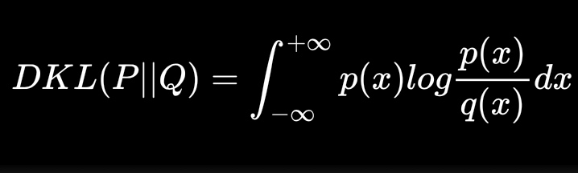
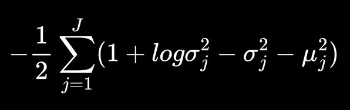
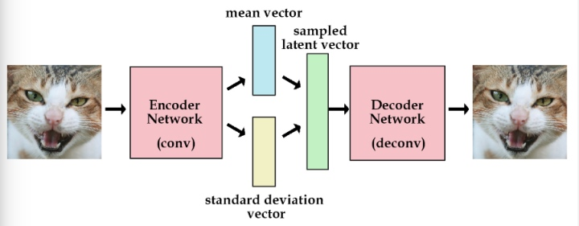

# VAE: Variantional AutoEncoder


前置数学知识:

- 什么是KL散度?





- 两个高斯分布的KL散度如何计算?

https://zhuanlan.zhihu.com/p/55778595

- VAE的损失函数如何计算? 由重构损失和KL散度两个部分组成


化简可以得到:




- VAE的结构(重参数):




什么是重参数?

只管来说, 如果:

- 不使用重参数: 则神经网络直接预测一个向量, 该向量服从正态分布
- 使用重参数: 神经网络预测两个均值向量, 方差向量(标准差), 然后从标准正态分布中随机采样一个向量, 这样组成一个服从正态分布的向量

从结果上看, 他们都可以得到一个向量, 其服从正态分布.

- 为什么要做重参数?

    好处主要有:

    1. 更容易训练


- VAE损失函数的实现: 很简单

```python
reconstruction_function = nn.BCELoss(size_average=False)  # mse loss

def loss_function(recon_x, x, mu, logvar):
    """
    recon_x: generating images 右边这只猫
    x: origin images 左边这只猫
    mu: latent mean 蓝色框向量
    logvar: latent log variance 黄色框向量
    """
    # 重建损失, 就是计算两只猫的mse
    BCE = reconstruction_function(recon_x, x)
    # loss = 0.5 * sum(1 + log(sigma^2) - mu^2 - sigma^2)
    KLD_element = mu.pow(2).add_(logvar.exp()).mul_(-1).add_(1).add_(logvar)
    KLD = torch.sum(KLD_element).mul_(-0.5)
    # KL divergence
    return BCE + KLD
```


- 如何理解变分? vairiance 

    @TODO